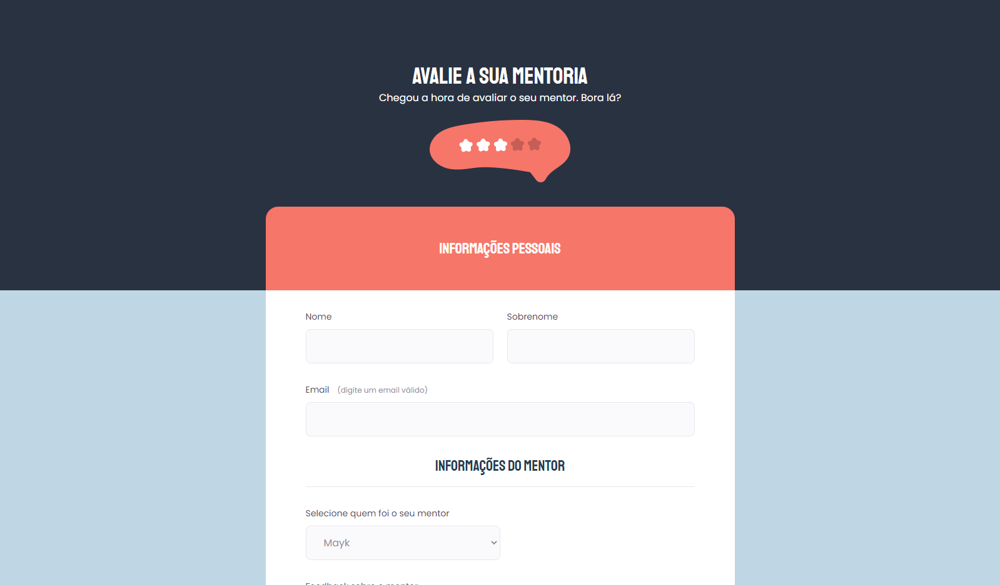

# Desafio - Criando formulários (Avançado)

> Explorer Stage 03 da Rocketseat

## 📝 Descrição
Projeto desenvolvido no curso Explorer da Rocketseat. 

A proposta era criar um formulário para avaliação da mentoria do desafio anterior com os conhecimentos adquiridos e o uso de select e checkbox. 

## 🔗 Links

[Clique aqui para acessar](https://daniyuk.github.io/explorer-formulario-02)

[Design no figma](https://www.figma.com/file/fnZyJHs7eqNFAA7tUrKcsD/Stage-03---Formul%C3%A1rio-avan%C3%A7ado/duplicate)

## 💻 Tecnologias 
- HTML
- CSS